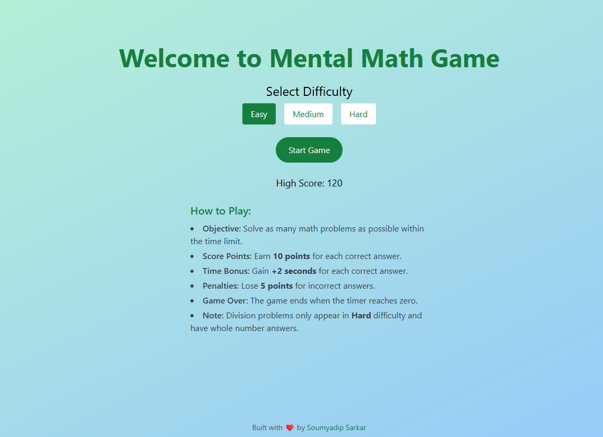

# Mental Math Game

Welcome to the Mental Math Game, a web-based application designed to challenge and improve your arithmetic skills under time pressure. Built with React, Vite, and TypeScript, this game offers varying difficulty levels and incorporates all basic mathematical operations, including addition, subtraction, multiplication, and division.



## Demo

[Live Demo Link](https://mental-math.soumyadipsarkar.in/)

## Features

- **Multiple Difficulty Levels:** Choose from Easy, Medium, and Hard levels to match your skill.
- **All Basic Operations:** Includes addition, subtraction, multiplication, and division.
- **Responsive Design:** Optimized for both desktop and mobile devices.
- **Dynamic Scoring System:**
  - Earn points for correct answers.
  - Time bonuses for quick and accurate responses.
  - Penalties for incorrect answers.
- **Dark Mode Activation:** Automatically switches to dark mode upon reaching a high score.
- **Sound Effects:** Enjoy feedback with correct and incorrect sounds.
- **High Score Tracking:** Your highest score is saved locally.
- **User-Friendly Interface:** Clean design with intuitive controls.
- **Separate Components:** Organized codebase with reusable components.

## How to Play

1. **Select Difficulty:** On the home screen, choose your desired difficulty level—Easy, Medium, or Hard.
2. **Start the Game:** Click on the "Start Game" button to begin.
3. **Objective:** Solve as many math problems as possible within the time limit.
4. **Score Points:**
   - **Correct Hit:** Earn 10 points and gain +2 seconds on the timer.
   - **Incorrect Click:** Lose 5 points.
5. **Game Over:** The game ends when the timer reaches zero. Try to beat your high score!
6. **Controls During Game:**
   - **Exit Game:** Return to the home screen.
   - **Restart:** Start a new game with the current difficulty.

## Installation

### Prerequisites

- Node.js (v12 or above)
- npm (comes with Node.js)

### Steps

1. Clone the Repository:
   ```bash
   git clone https://github.com/neuralsorcerer/mental-math-game.git
   ```
2. Navigate to the Project Directory:
   ```bash
   cd mental-math-game
   ```
3. Install Dependencies:
   ```bash
   npm install
   ```

## Usage

### Running the Development Server

```bash
npm run dev
```

Open your browser and navigate to `http://localhost:5173` to play the game.

### Building for Production

```bash
npm run build
```

The optimized production build will be in the `dist` folder.

## Built With

- **React** - A JavaScript library for building user interfaces.
- **TypeScript** - A typed superset of JavaScript.
- **Vite** - A fast build tool and development server.
- **Tailwind CSS** - A utility-first CSS framework.
- **use-sound** - A React hook for playing sound effects.

## License

This project is licensed under the [MIT License](LICENSE).
